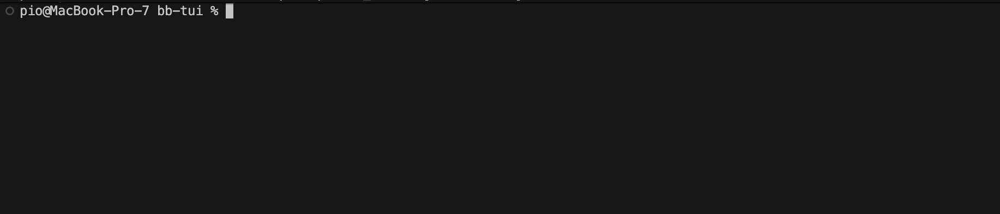

# Doorbell
An entry point for babashka scripts.

Doorbell parses CLI arguments and if any of them are missing it asks user to provide them through interactive TUI form.

If you provide all the required args via CLI, TUI is not triggered so scripts can still work without tty user input.



## Installation

Add to your `bb.edn` or `deps.edn`:

```clojure
{:deps {io.github.roterski/doorbell {:git/url "https://github.com/roterski/doorbell"
                                     :git/sha "2bd5ea9501a7f113cef35e3c840dc0e43811b9bf"}}}
```

## Usage

`roterski.doorbell/cli->data` returns data coerced to `schema` that comes from combining `*command-line-args*` with user-input from interactive TUI.

### Simple form

```clojure
(ns examples.simple-form
  (:require [roterski.doorbell :as doorbell]))

(println (doorbell/cli->data [:map
                              [:name {:default "foo"} :string]]))
```
run it with
````
bb examples/simple_form.clj
````

### Form with nested fields

```clojure
(println (doorbell/cli->data [:map
                              [:first-name :string]
                              [:last-name {:optional true} :string]
                              [:age [:int {:min 18}]]
                              [:looks
                               [:map
                                [:eye-color [:enum :brown :blue :green :hazel :gray]]
                                [:tattoos? :boolean]]]
                              [:mood {:default "good"} :string]]))
```

Run interactively (launches TUI when args are missing):

```sh
bb examples/person_form.clj
```

Run non-interactively by providing all required args:

```sh
bb examples/person_form.clj -first-name Bob --age 30 looks.eye-color blue "looks.tattoos?" true :mood okay "do-you-know-them?" true
```

- keys can be prefixed with `-`,  `--`, `:` or nothing - the lib treats them the same way, ignoring the prefix
- nested keys use dot notation on the command line (e.g. `looks.eye-color`)

## Limitations
- args must be key/value pair
- attributes ending with `?` need to be wrapped in `" "` quotes
- no support for vectors/sequences values in schemas

